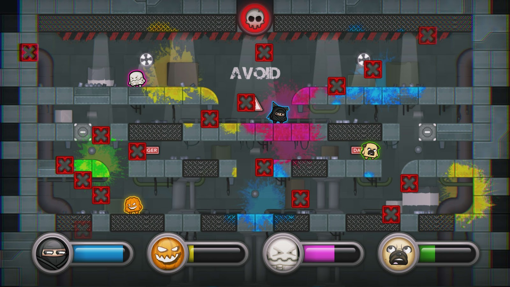
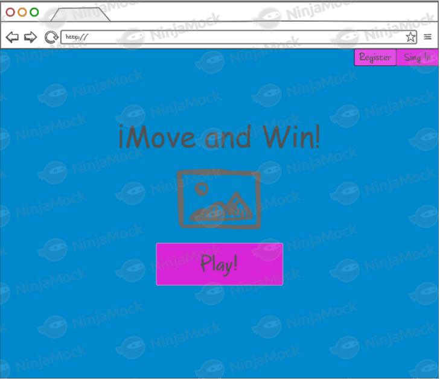
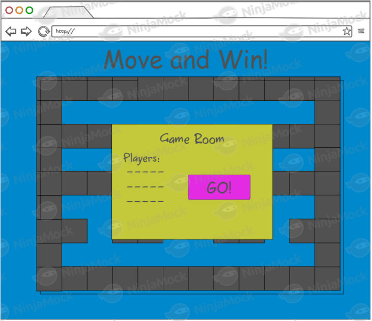
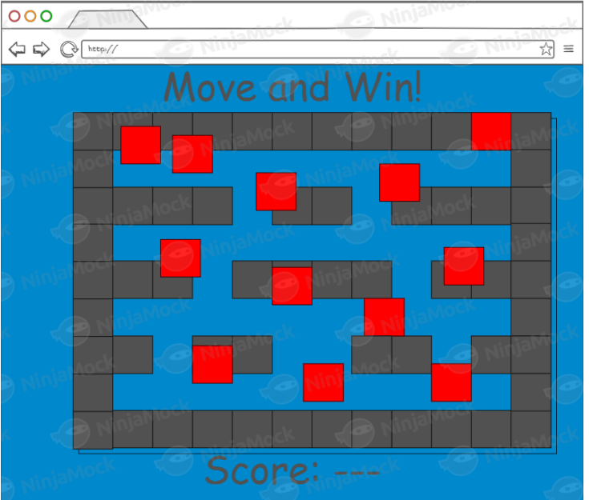

# Move Catch and Win Game

## Team
Kevin Mendieta : [KevinMendieta](https://github.com/KevinMendieta)

Sebastian Moreno : [Zekkenn](https://github.com/Zekkenn)

Jossie Murcia : [JEMurcia](https://github.com/JEMurcia)

## Views

## Description
This project is based on the popular arcade party game [Move or Die](http://www.moveordiegame.com/)
,specifically the game mode called [Falling Blocks](http://move-or-die.wikia.com/wiki/Gamemodes)

The idea it's to provide a web app where the users can register on the app in order to play the game mode online
with different people arround the internet.

For this the users can create a room or join a axisting room.
 

We want to use REST architecture and Publish and Subscribe architecture for implement all the features above.

## Diagrams
